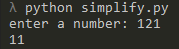
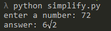
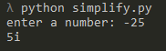

# Python root simplifier.

## How to use

* Run "simplify.py" file in your terminal.
* Enter a number to calculate the root
* And program will calculate the root and simplify it
### NOTE: The tool can also be used for complex numbers

## Examples
\
\
